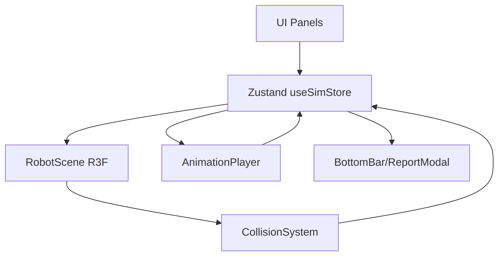

## Robot Arm Digital Twin — 발표자료 (v1)

> 제출용 발표 문서(8–10장 구성).  
> 각 섹션은 “슬라이드 1장”처럼 사용하도록 작성했습니다.  
> 스크린샷/영상은 아래 자리표시에 경로/링크만 채워 넣으면 됩니다.

---

## 1) 과제 목표 재해석 (문제 정의)

### 요구사항 요약
- 웹에서 **로봇 팔(최소 3축)** 을 3D로 시각화
- 운영자가 **JOG(관절 각도)** 를 제어
- 3D 공간에 **박스 장애물** 을 추가/배치
- 조작 시 **충돌 가능성 시각적 경고**(색상 변화 등)

### 우리가 재해석한 “진짜 목표”
- 실제 장비를 움직이기 전, 운영자가 웹에서 **안전 검증(충돌 위험 탐지)** 을 빠르게 수행
- 단순 데모가 아니라, 반복 사용 가능한 **작업 플로우(조작→배치→검증→리포트)** 제공

**[캡처/영상 자리표시]**
- 영상 링크: <여기에 데모 영상 링크>
- 

---

## 2) 데모 시나리오 (운영자 관점)

### 10초 데모 플로우
1) Robot JOG로 자세/베이스 방향 조정  
2) Obstacle 추가 → 위치 조정  
3) 경고/충돌 색상 확인 (근접=경고, 접촉=충돌)  
4) Animator에서 간단 애니메이션 생성/수정  
5) Simulation Start → 충돌 발생 시 Stop on collision(옵션)  
6) Collision Report 확인(모달/BottomBar)

**[캡처/영상 자리표시]**
- 
- 

---

## 3) 시스템 개요 (기술 스택 & 데이터 흐름)

### 기술 스택
- **React + TypeScript**
- **React Three Fiber(R3F) + Drei**: 3D 씬/조명/컨트롤
- **Zustand**: 상태 관리(로봇 pose, obstacle, collision, animation, playback)

### 데이터 흐름(핵심)
- UI 입력(슬라이더/버튼/에디터) → Zustand store 업데이트  
- 씬(`RobotScene`)이 store를 구독 → 3D 오브젝트 갱신  
- CollisionSystem이 주기적으로 충돌 계산 → store에 collision 결과 기록  
- AnimationPlayer가 playback 진행 및 report 이벤트 기록



---

## 4) 프로젝트 구조 (폴더/모듈 역할)

### 구조 개요
```text
src/
  Three/                  # 3D 씬 구성(로봇/장애물/충돌/애니메이션)
    RobotScene.tsx        # Canvas + 씬 오케스트레이션
    Light.tsx             # HDRI 환경광/라이트
    Collision/            # 충돌 계산 + 디버그 박스
    Animation/            # 플레이백(시뮬레이션)
    Robot/                # GLB 로딩 + joint rig 구성
  UI/                     # 패널/오버레이/리포트
    JogPanel.tsx
    ObstaclePanel.tsx
    TopBar.tsx
    BottomBar.tsx
    SimulationReport/
    AnimationEditor/
  store/                  # Zustand store (slice 기반)
    useSimStore.ts        # 단일 entrypoint (slice 합성)
    types.ts              # 전역 타입
    slices/               # 도메인별 상태/액션 분리
public/animations/        # 애니메이션 프리셋 JSON (manifest 기반)
```

### 구조적 의미(핵심 의도)
- `UI/`는 **입력/표현**, `Three/`는 **시뮬레이션/시각화**, `store/`는 **상태/도메인 로직** 중심
- “기능을 늘려도” 유지보수 가능하도록 **도메인 분리**를 유지

---

## 5) 왜 이런 구조를 선택했는가 (설계 의도)

### 1) 단일 Store 공개 API + 내부 Slice 분리
- 외부에서 사용하는 API는 `useSimStore` 하나로 유지 (`src/store/useSimStore.ts`)
- 내부는 slice로 분리(`src/store/slices/*`)해 기능 추가/수정을 안전하게

### 2) 렌더링과 “시뮬레이션 로직”을 분리
- 3D 렌더(`RobotScene`)와 충돌 계산(`CollisionSystem`)을 분리하여
  - 성능/디버깅/확장에 유리

### 3) 애니메이션 “에디터”와 “플레이어” 분리
- `AnimationEditorOverlay`: 제작/편집/Import·Export
- `AnimationPlayer`: 재생/루프/stop-on-collision/리포트 기록

---

## 6) 제공 기능 정리 (요구사항 충족)

### JOG 기능 & UI
- joint 별 angle 제어(슬라이더 + hold-to-repeat)
- 베이스 yaw 제어 + 로봇 XZ 이동(TransformControls 기반)

**[캡처]**
- 

### Obstacle 추가/변경 & UI
- 박스 장애물 추가/선택/삭제
- gizmo로 위치/회전 조정(씬 상에서 직접 조작)
- 수치 입력 UX 개선(값 삭제/음수/큰 값 입력 가능)

**[캡처]**
- 

### 충돌 관련 기능(시각적 경고)
- 근접 경고 / 충돌 접촉 시 robot mesh tint 변경
- Debug: Boxes 토글로 충돌 볼륨 확인

**[캡처]**
- 
- 

---

## 7) 제공 기능 정리 (확장 기능)

### Animation 생성 기능(Animator)
- Layer 기반 타임라인(1초 슬롯)
- Target: BaseYaw 또는 joint
- Import/Export(JSON) 지원

**[캡처]**
- 

### 시뮬레이션 기능(Playback)
- Simulation Start/Stop
- loop 모드 지원(예: pingpong)
- **Stop on collision** 옵션

### Report 기능
- 충돌 발생 시 이벤트를 기록
- 시뮬레이션 종료/중단 시 리포트 확인
- BottomBar에서 최신 이벤트 + Full report 접근

**[캡처]**
- 
- 

---

## 8) 요구사항 외 구현(가산점 요소)

### 1) 구조적 확장성
- store를 slice 기반으로 리팩터링해 기능 확장에 유리

### 2) UX 개선
- 플레이백 중 JOG 입력 잠금(의도치 않은 충돌/상태 꼬임 방지)
- 숫자 입력 UX 개선(leading `0` 문제 해결, invalid revert)
- Boxes 디버그 시각화로 운영자/개발자 모두 확인 가능

### 3) 안정성/성능 관점
- 충돌 계산/렌더 분리, 일정 주기 업데이트(기본 20Hz)
- 소재/리소스 라이프사이클 관리(Obstacle material 생성/업데이트 방식)

---

## 9) 한계와 다음 개선 제안(로드맵)

### 현재 한계
- 충돌 정확도는 모델 단순화/OBB 근사에 의존
- BaseYaw 포함 애니메이션에서 robotPosition 스냅 이슈가 보고됨(추가 추적 필요)

### 개선 방향
- 정밀 충돌: BVH 기반 mesh collision 또는 collider 프록시(capsule/convex) 도입
- self-collision: 더 안정적인 collider 정의 후 옵션 재도입
- 시뮬레이션 품질: step/time integration 분리, deterministic replay

---

## 10) 제출물 체크리스트 (영상/스크린샷 포인트)

### 필수 캡처(권장)
- 메인 화면(로봇 + UI 패널)
- JOG로 관절 움직임
- 장애물 추가/배치 + 경고 색상 변화
- Animator에서 box 추가/편집 + Export/Import
- Simulation Start + Stop on collision 동작
- Collision Report(모달/BottomBar)

### 제출 파일 후보
- 소스코드: 현재 repo
- 동영상: <링크 또는 파일명>
- 본 문서: `PRESENTATION_v1.md`

